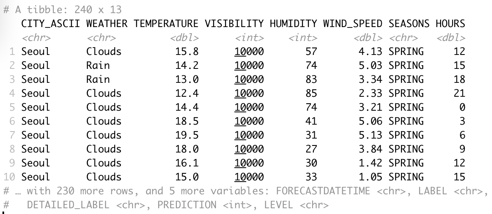

# Bike Sharing Demand Prediction Dashboard (R Shiny and Leaflet)

## Description
This is an interactive R Shiny dashboard using Leaflet that displays weather forecast data and predicted hourly bike-sharing demand for the following cities:\
`New York, USA`, `Paris, France`, `Suzhou, China`, and `London, UK` (they have similar bike rental fleet sizes as `Seoul, South Korea`).

It uses a Leaflet-based interactive map that shows the maximum predicted bike-sharing demand in the next 5 days.
The predictions are based on the outcome of a provided regression model, which in turn utilises weather forecast data from the OpenWeather API as its input.

RStudio was used as the development environment.

## Tasks
- Add a basic max bike prediction overview map.
- Add a dropdown to select a specific city.

## Download Project Files
Run `download_project_files.R` to download the project files:
- `selected_cities.csv`: Geo information about `Seoul, South Korea`, `New York, USA`, `Paris, France`, `Suzhou, China`, and `London, UK`.
- `model.csv`: Trained regression model with variables, coefficients, and intercept. This can be replaced with a different model trained in previous notebooks.
- `model_prediction.R`: Contains functions like OpenWeather API calls, hourly bike-sharing prediction, etc. It provides the data frame needed to develop the app. The source code can be modified to use other trained models. Replace the OpenWeather API key with your own.
- `ui.R`: Contains the frontend code of the Shiny app.
- `server.R` Contains the backend code of the Shiny app.

Load `model_prediction.R` in RStudio and click **Run app** to display the Shiny dashboard.

- The high level Leaflest based map should show the above cities with circle markers.
- The dropdown allows selecting all cities or a specific one.
- The charts show the **Temperature**, **Predicted bike demand** and **Correlation between predicted bike demand and humidity**.